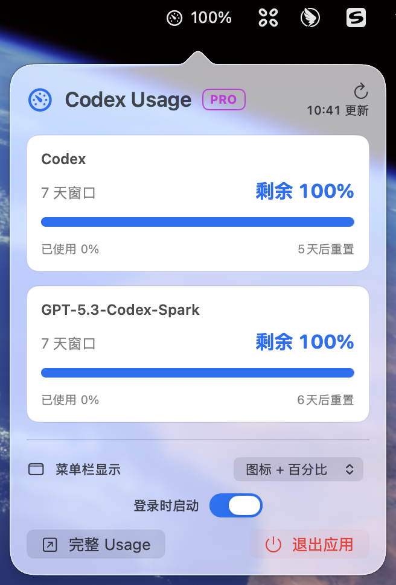

# Codex Remaining

一个轻量的原生 macOS 菜单栏应用，通过本机 `codex app-server` 展示 ChatGPT 账户中的 Codex 剩余额度。无需反复打开 Usage 页面，即可在菜单栏快速确认当前最紧张的额度窗口和重置时间。

[下载最新版本](https://github.com/tanjuntao/codex-remaining-menubar/releases/latest)

<p align="center">
  
</p>

## 功能亮点

- 在菜单栏直接显示最紧张额度窗口的剩余百分比
- 支持“图标 + 百分比”“仅图标”“仅百分比”三种菜单栏展示方式
- 弹窗展示所有 `rateLimitsByLimitId` 额度桶
- 展示已用/剩余比例、窗口长度和重置时间
- 复用 Codex App Server 管理的 ChatGPT 登录状态
- 未登录时发起官方 ChatGPT 浏览器登录
- 每 5 分钟自动刷新，并监听额度变化通知
- 缓存最后一次成功结果，断网时保留展示
- 支持登录时启动和打开完整 Usage 页面
- 支持 `⌘R` 刷新、`⌘U` 打开完整 Usage、`⌘W` 关闭面板和 `⌘Q` 退出

## 下载与安装

1. 前往 [GitHub Releases](https://github.com/tanjuntao/codex-remaining-menubar/releases/latest)，下载最新的 `Codex-Remaining-<version>.dmg`。
2. 打开 DMG，将 `Codex Remaining.app` 拖入 `Applications`。
3. 从“应用程序”启动 Codex Remaining。

发布文件使用 ad-hoc 签名，没有经过 Apple Notarization，因此首次启动时 macOS 会提示无法验证开发者。尝试启动一次后，打开“系统设置 → 隐私与安全性”，滚动到“安全性”，点击“仍要打开”，输入登录密码并再次确认。放行后，该版本可以正常启动。macOS Sequoia 及更高版本应使用这个系统设置入口，不要依赖右键打开。

只有在确认 DMG 来自本仓库的 GitHub Releases 且校验值匹配时才应手动放行。每个 Release 都会附带 `.dmg.sha256` 文件，可以在下载目录验证：

```bash
shasum -a 256 -c Codex-Remaining-<version>.dmg.sha256
```

关于 Gatekeeper 的风险与操作方式，请参阅 [Apple 官方说明](https://support.apple.com/guide/mac-help/open-a-mac-app-from-an-unknown-developer-mh40616/mac)。

## 环境要求

- macOS 13 或更高版本
- Xcode Command Line Tools
- Swift 6.0 或更高版本
- 已安装支持 `app-server` 的 Codex CLI
- 已登录 ChatGPT/Codex；未登录时也可从应用内发起登录

可以先确认本地工具链：

```bash
xcode-select -p
swift --version
codex --version
```

GUI 应用继承的 `PATH` 通常比交互式 Shell 短。应用会自动检查 Homebrew、`~/.local/bin`、Volta、pnpm 和 NVM 的常见安装位置；如仍无法发现 Codex CLI，可在开发环境中设置 `CODEX_EXECUTABLE` 为 `codex` 可执行文件的绝对路径。

## 本地构建

克隆仓库并运行测试：

```bash
git clone git@github.com:tanjuntao/codex-remaining-menubar.git
cd codex-remaining-menubar
make test
```

构建可运行的 macOS 应用：

```bash
make app
open "dist/Codex Remaining.app"
```

`make app` 默认执行 release 构建。`Scripts/build-app.sh` 会使用 SwiftPM 编译可执行文件，在 `dist/` 下组装标准 `.app` Bundle，并使用临时签名（ad-hoc signing）完成本机开发构建。整个流程只需要 Xcode Command Line Tools，不要求安装完整 Xcode。

如需调试构建，可显式指定配置：

```bash
CONFIGURATION=debug ./Scripts/build-app.sh
```

## 本地安装

构建完成后，可以直接从 `dist/` 启动，也可以复制到 `/Applications`：

```bash
ditto "dist/Codex Remaining.app" "/Applications/Codex Remaining.app"
open "/Applications/Codex Remaining.app"
```

应用属于菜单栏应用，启动后不会在 Dock 中显示。若要卸载，先退出应用，再移除 `/Applications/Codex Remaining.app`；应用缓存位于自己的 Application Support 目录，删除应用本体不会自动清理缓存。

## 本地打包 DMG

```bash
make test
make dmg
```

`make dmg` 会分别构建 `arm64` 与 `x86_64`，合并为 Universal Binary，使用 ad-hoc 签名，然后在 `dist/` 生成：

- `Codex-Remaining-<version>.dmg`
- `Codex-Remaining-<version>.dmg.sha256`

这个流程不需要 Apple Developer Program 会员、Developer ID 证书或 Notarization 凭据。

## 常用开发命令

```bash
make build  # SwiftPM debug 构建
make test   # 运行测试
make app    # 组装 release .app
make dmg    # 构建 Universal App 并生成 DMG 与 SHA-256
make run    # 构建并启动应用
make clean  # 清理 SwiftPM 构建产物
```

`Scripts/test.sh` 兼容仅安装 Command Line Tools 时 Swift Testing framework 不在默认搜索路径的问题。

## 分发说明

仓库通过 GitHub Actions 自动发布。创建并推送符合 `vX.Y.Z` 格式的 Tag 后，工作流会运行测试、构建 Universal DMG、校验产物，并创建包含 DMG、SHA-256 和自动生成发布说明的 GitHub Release。

```bash
git tag -a v0.1.0 -m "Codex Remaining 0.1.0"
git push origin v0.1.0
```

完整维护者发布流程见 [docs/RELEASING.md](./docs/RELEASING.md)。如果未来配置 Developer ID，可以在保持 GitHub Release 分发方式不变的情况下增加签名和 Notarization。

## 数据与隐私

应用不会读取 ChatGPT Cookie、不会提取 Keychain Token，也不会保存访问令牌。登录、Token 刷新和 Usage 请求都由本机 Codex App Server 负责。应用只缓存渲染所需的额度结果，缓存位于自己的 Application Support 目录。

## 已知边界

- 这里只展示 Codex App Server 返回的 Codex/ChatGPT rate-limit 数据，不代表 OpenAI Platform API 组织用量。
- App Server 协议会随 Codex CLI 版本演进；解析器会忽略未知字段，但重大协议升级可能需要适配。
- GitHub Release 中的应用使用 ad-hoc 签名且未经 Apple Notarization，用户首次启动必须在系统设置中手动放行。
- Mac App Store 沙箱会限制启动外部 CLI 和复用 `~/.codex`，因此当前仅采用 GitHub Release 直接分发。
